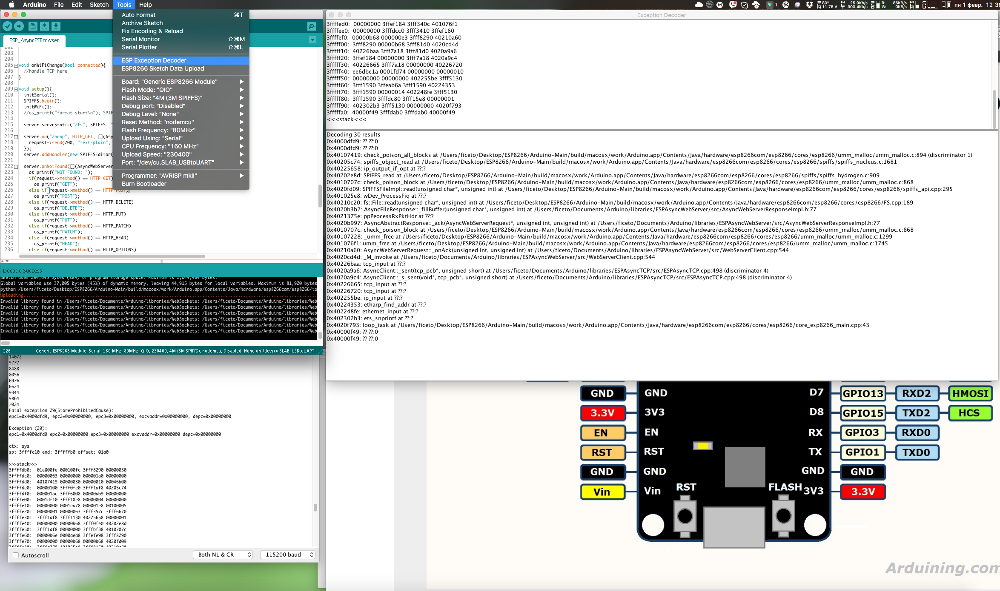

# Arduino ESP8266/ESP32 Exception Stack Trace Decoder 

Arduino plugin which lets you get a more meaningful explanation of the stack traces you get on ESP8266.

## Installation
- Make sure you use one of the supported versions of Arduino IDE and have ESP8266 core installed.
- Download the tool archive from [releases page](https://github.com/me-no-dev/EspExceptionDecoder/releases/latest).
- In your Arduino sketchbook directory, create tools directory if it doesn't exist yet.
- Unpack the tool into tools directory (the path will look like `<home_dir>/Arduino/tools/EspExceptionDecoder/tool/EspExceptionDecoder.jar)`.
- Restart Arduino IDE.

## Usage
- Open a sketch and build it.
- Upload the sketch and monitor the Serial port for Exceptions
- When you get an Exception, open *Tools > ESP Exception Decoder* menu item. This will open a new window.
- Paste the stack trace into the window's top pane and the result will show in the bottom.
- Every time you enter new address or stack trace, the results will refresh

## Gedit Highlighting
You can use the *StackTrace* utility to have gedit highlight the above stack trace for easy viewing. More details can be found here: https://github.com/electronicsguy/ESP8266/tree/master/Misc/StackTrace

## Credits and license

- Copyright (c) 2015 Hristo Gochkov (ficeto at ficeto dot com)
- Licensed under GPL v2 ([text](LICENSE))
